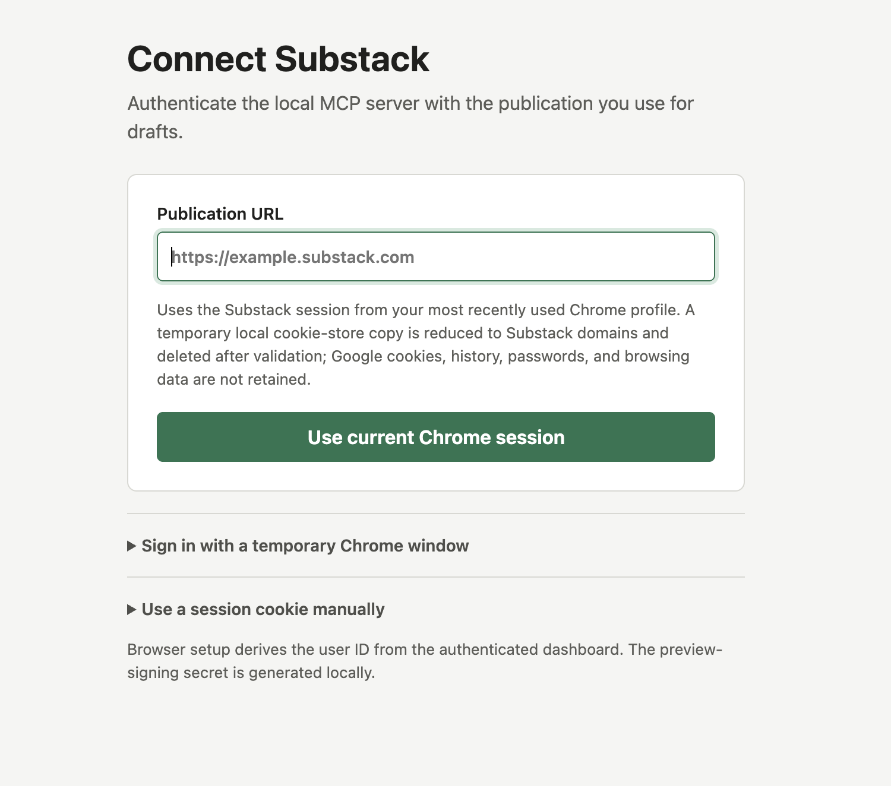
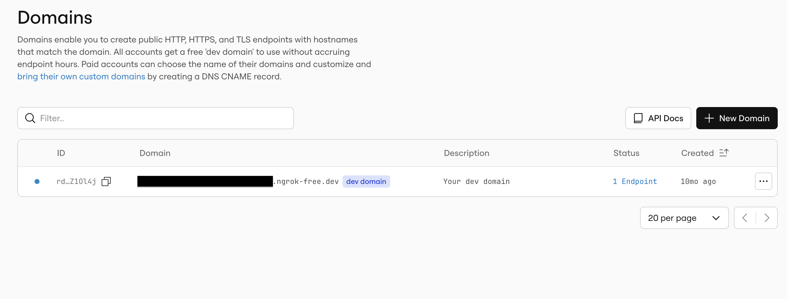
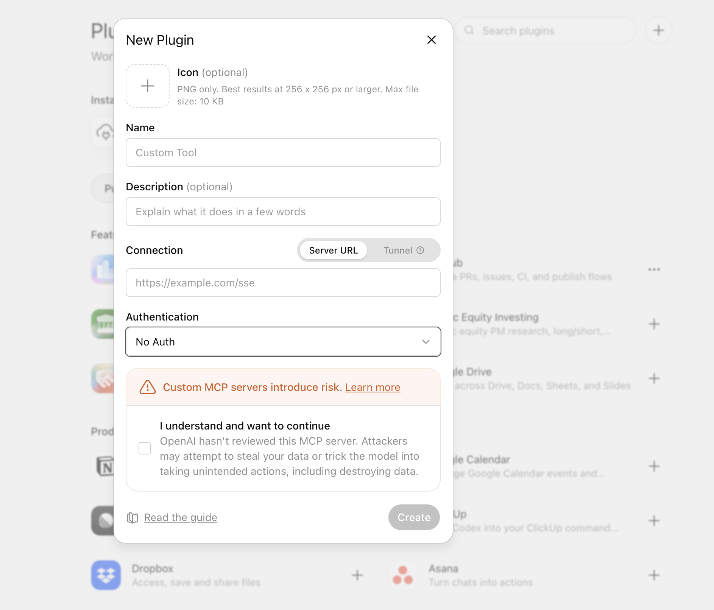

# Connect the Substack Draft MCP Server to Your AI Client

This guide takes the server from a fresh checkout to a working MCP connection in ChatGPT, Claude, Claude Desktop, or Claude Code. The server is intentionally draft-only: you review and publish in Substack yourself.

Substack does not provide an official public API for this workflow. This project uses unofficial endpoints, so integrations may need maintenance when Substack changes its editor or API behavior.

## What you need

- Node.js 20 or newer and `npm`. Check with `node --version` and `npm --version`.
- Your own Substack publication and an account with administrative access to it.
- A local checkout of this repository.
- For remote clients, a free [ngrok account](https://ngrok.com/) and the ngrok Agent CLI.
- A client plan that supports custom MCP servers. Product availability, permissions, and UI labels can vary by plan and may change.

Never paste a Substack session cookie, auth file, bearer token, or preview secret into a chat, issue, screenshot, committed file, or public post.

## 1. Install, authenticate, and build

Run these commands from the repository root:

```bash
npm ci
npm run auth:setup
npm run build
npm run mcp:preflight -- --require-live
```

`npm ci` installs exactly the dependencies in the committed lockfile. `npm run auth:setup` opens a temporary page on `127.0.0.1` and guides you through authenticating your own publication. On macOS it can import the most recently used Chrome session after you explicitly approve it; an isolated browser sign-in and manual cookie entry are available as fallbacks.

<figure markdown="span">
  { width="760" loading="lazy" }
  <figcaption>The local authentication page opened by <code>npm run auth:setup</code>.</figcaption>
</figure>

Successful setup stores the publication URL, session value, numeric user ID, and a generated preview-signing secret in the ignored, owner-only `.data/substack-auth.json` file. Do not commit or share that file.

The focused preflight checks that the local credentials and runtime prerequisites are present and valid-shaped. It does not create, update, publish, or delete a Substack post.

## 2. Know the server's tool surface

A correctly connected client should discover exactly these seven draft tools:

- `create_draft`
- `get_draft`
- `list_drafts`
- `preview_draft`
- `update_draft`
- `upload_image`
- `validate_newsletter_content`

Creating or updating content requires a matching preview confirmation token. Publishing, scheduling, deleting, emailing, and creating public Notes are outside this server's scope.

## 3. Run the HTTP server locally

In terminal A, from the repository root, start the built HTTP entrypoint explicitly on loopback port 8787:

```bash
HOST=127.0.0.1 PORT=8787 MCP_TRANSPORT=http AUTH_MODE=noauth npm run start:http
```

Leave that process running. In terminal B, verify its health endpoint:

```bash
curl --fail --show-error http://127.0.0.1:8787/healthz
```

The local MCP endpoint is:

```text
http://127.0.0.1:8787/mcp
```

Localhost works for software running on your machine. ChatGPT and Claude remote connectors connect from cloud infrastructure, so they require a publicly reachable HTTPS endpoint instead.

## 4. Give the local server a stable HTTPS address with ngrok

Follow ngrok's official [Agent CLI quickstart](https://ngrok.com/docs/getting-started) for the current installation options.

### Create and connect your ngrok account

1. Sign up for an ngrok account.
2. Install the Agent CLI. For example, on macOS with Homebrew:

   ```bash
   brew install ngrok
   ```

3. Confirm the command is available:

   ```bash
   ngrok help
   ```

4. Copy your authtoken from the ngrok dashboard and save it locally. Replace the placeholder; never publish the real value:

   ```bash
   ngrok config add-authtoken YOUR_NGROK_AUTHTOKEN
   ```

### Find your automatically assigned Dev Domain

Every ngrok account receives an automatically generated Dev Domain. Open the ngrok dashboard and look under **Domains** (the exact navigation label may vary), then copy the account's assigned hostname. On the free plan, the name is assigned for you and cannot be changed. See ngrok's official [Domains guide](https://ngrok.com/docs/gateway/domains#dev-domains).

<figure markdown="span">
  { width="1000" loading="lazy" }
  <figcaption>Copy the assigned <code>ngrok-free.dev</code> hostname from the ngrok Domains dashboard.</figcaption>
</figure>

Use only a placeholder in reusable commands and documentation:

```text
YOUR_ASSIGNED_DOMAIN.ngrok-free.dev
```

### Start the tunnel

Keep the local HTTP server running in terminal A. In terminal B, replace the placeholder with the hostname shown in your ngrok account and run:

```bash
ngrok http --url YOUR_ASSIGNED_DOMAIN.ngrok-free.dev 8787
```

Your stable remote MCP endpoint is then:

```text
https://YOUR_ASSIGNED_DOMAIN.ngrok-free.dev/mcp
```

In terminal C, run the repository's remote smoke test:

```bash
npm run smoke:remote-noauth -- --url https://YOUR_ASSIGNED_DOMAIN.ngrok-free.dev/mcp
```

The smoke test checks the remote health endpoint, verifies the seven-tool contract, and exercises validation and preview behavior without calling Substack or running a write tool.

### Stable hostname does not mean always online

The Dev Domain hostname remains assigned to your account, so you can reuse the same connector URL across tunnel restarts. The service is reachable only while both processes are running:

1. the local Node.js HTTP server; and
2. the ngrok agent forwarding that domain to port 8787.

If either process stops, the hostname stays yours but the MCP endpoint is offline. Restart both processes to bring the same URL back.

> **Security warning:** `AUTH_MODE=noauth` is only for short-lived, personal testing. Anyone who obtains the live URL can reach the MCP server under your local Substack identity while the tunnel is active. Keep the URL private, run the tunnel for the shortest practical window, watch the terminal output, and stop both processes when testing ends. Use proper client authentication for any durable or shared deployment. If the URL or local credentials may have leaked, stop the tunnel and rotate the affected credentials.

## Connect a remote HTTPS client

The remote setup is client-neutral: first make the HTTPS endpoint pass the smoke test, then give the client the full URL ending in `/mcp`. Do not enter the health URL, the bare ngrok hostname, or the local `127.0.0.1` URL.

Product UI labels and eligibility can differ by plan. Use the linked official documentation if your menus do not exactly match the labels below.

### ChatGPT remote

ChatGPT does not connect directly to a local MCP process; use the remote HTTPS endpoint. Full MCP support, including this server's write actions, is currently documented for Business and Enterprise/Edu workspaces. Admin or owner action may also be required. Consult OpenAI's current [Developer mode documentation](https://help.openai.com/en/articles/12584461-developer-mode-and-mcp-apps-in-chatgpt) before starting because plan availability can change.

<figure markdown="span">
  { width="760" loading="lazy" }
  <figcaption>The ChatGPT <strong>New Plugin</strong> dialog used in the steps below.</figcaption>
</figure>

1. Keep the local server and ngrok tunnel running, and confirm the remote smoke test passes.
2. In ChatGPT on the web, enable **Developer mode** for your account. Depending on plan and role, this may be available in advanced settings or while creating a plugin from workspace settings.
3. Open **Settings → Plugins**, select **+**, and choose to create a plugin. If your workspace centrally manages plugins, an owner or administrator may need to complete this step.
4. Enter a clear plugin name such as `Substack Drafts` and provide the complete remote endpoint in **Server URL**:

   ```text
   https://YOUR_ASSIGNED_DOMAIN.ngrok-free.dev/mcp
   ```

5. For this short-lived test endpoint, select the option that represents no authentication, if the form asks. Never paste Substack credentials into the plugin form.
6. Select **Scan Tools**, wait for discovery to finish, verify that seven tools appear, and select **Create**.
7. Start a new chat, enable the draft plugin from the tools or plugins menu, and begin with a validation or preview request before approving any draft write.

Only share or publish the plugin to a workspace after replacing this short-lived no-auth tunnel with an appropriately authenticated, reviewed deployment.

### Claude remote

Claude remote custom connectors are brokered through Anthropic's cloud infrastructure, including when the UI is Claude Desktop. They therefore require the public HTTPS endpoint, not localhost. See Anthropic's current [remote custom connector guide](https://support.claude.com/en/articles/11175166-get-started-with-custom-connectors-using-remote-mcp).

For an individual Free, Pro, or Max plan (Free is currently limited to one custom connector):

1. Keep the local server and ngrok tunnel running, and confirm the remote smoke test passes.
2. Open **Customize → Connectors** in Claude.
3. Select **+ → Add custom connector**.
4. Enter a name and the complete remote endpoint ending in `/mcp`.
5. Complete the add flow. For this short-lived no-auth test, do not enter OAuth client credentials or Substack credentials.
6. In a conversation, open the **+** or tools menu, choose **Connectors**, and enable the connector for that conversation.
7. Review tool approval requests carefully, especially before allowing a draft write.

For Team or Enterprise organizations, an Owner or Primary Owner generally adds the URL under **Organization settings → Connectors → Add → Custom → Web**. Members then connect and enable it from their own connector settings. Labels and permissions may vary by plan.

## Connect a local stdio client

Stdio is the simplest private option for desktop software that can launch a local process. It does not need ngrok, and the Substack credentials remain on your machine.

The server loads `.data/substack-auth.json` relative to its working directory. The examples below deliberately change into the repository before starting the built stdio entrypoint; this avoids copying secrets into a client configuration file.

Replace `/absolute/path/to/substack-mcp` with the real absolute path to your checkout. The shell examples use `/bin/sh` on macOS and Linux; adapt the wrapper for Windows if needed.

### Claude Desktop local stdio

The official MCP tutorial, [Connect to local MCP servers](https://modelcontextprotocol.io/docs/develop/connect-local-servers), documents the current Claude Desktop configuration flow and file locations.

1. Build and smoke-test the stdio transport in the repository:

   ```bash
   npm run build
   npm run smoke:stdio
   ```

2. In Claude Desktop, open the application menu and choose **Settings → Developer → Edit Config**. This opens `~/Library/Application Support/Claude/claude_desktop_config.json` on macOS or `%APPDATA%\Claude\claude_desktop_config.json` on Windows.
3. Add this entry inside the existing top-level `mcpServers` object. Preserve any other configured servers:

   ```json
   {
     "mcpServers": {
       "substack-drafts": {
         "command": "/bin/sh",
         "args": [
           "-c",
           "cd '/absolute/path/to/substack-mcp' && MCP_TRANSPORT=stdio AUTH_MODE=noauth exec node dist/stdio.js"
         ]
       }
     }
   }
   ```

4. Save the file, completely quit Claude Desktop, and reopen it.
5. Open the connectors/tools menu, choose **Manage connectors** if shown, and confirm `substack-drafts` is connected with seven tools.
6. Test a validation or preview request before allowing a draft write.

### Claude Code local stdio

Anthropic's [Claude Code MCP documentation](https://code.claude.com/docs/en/mcp) covers current transports, scopes, authentication, and management commands.

From the project where you want the connector available, add a private, project-local stdio server:

```bash
claude mcp add --transport stdio --scope local substack-drafts -- \
  /bin/sh -c "cd '/absolute/path/to/substack-mcp' && MCP_TRANSPORT=stdio AUTH_MODE=noauth exec node dist/stdio.js"
```

Then verify it:

```bash
claude mcp list
claude mcp get substack-drafts
```

Start Claude Code and use `/mcp` to inspect connection status. Local scope keeps the configuration private to you and associated with the current project.

### Claude Code remote HTTP

With the local HTTP server and ngrok tunnel running, add the remote endpoint:

```bash
claude mcp add --transport http --scope local substack-drafts \
  https://YOUR_ASSIGNED_DOMAIN.ngrok-free.dev/mcp
```

Verify it with `claude mcp list`, `claude mcp get substack-drafts`, and `/mcp` inside Claude Code. This no-auth form has the same short-lived personal-testing restriction as the ChatGPT and Claude remote examples.

## Update, restart, and refresh schemas

When you pull a new version or change server code:

1. Stop the local server with Ctrl-C.
2. From the repository root, reinstall from the lockfile and rebuild:

   ```bash
   npm ci
   npm run build
   npm run mcp:preflight -- --require-live
   ```

3. Restart the transport you use:
   - HTTP: restart `npm run start:http`, then restart ngrok with the same assigned Dev Domain.
   - stdio: completely restart the client so it launches the new `dist/stdio.js` process.
4. Refresh the client's cached tool schemas:
   - ChatGPT draft plugins: scan or refresh tools/actions. Published workspace plugins can use a frozen schema snapshot; current Business workspaces may need to recreate and republish a plugin, while Enterprise/Edu admins may have a **Refresh** action.
   - Claude remote connectors: if the schema remains stale, remove the custom connector and add it again, as described in Anthropic's connector guide.
   - Claude Desktop local stdio: completely quit and reopen the app.
   - Claude Code: inspect `/mcp`; restart the session or remove and re-add the server if it does not reconnect with the new schema.
5. Confirm the client again shows exactly seven tools before using write actions.

Changing code does not change the assigned ngrok hostname. Changing the transport, authentication mode, port, or endpoint path may require updating the client URL or configuration.

## Troubleshooting

### The server will not start

- Run `node --version`; this repository requires Node 20 or newer.
- Re-run `npm ci`, `npm run build`, and `npm run mcp:preflight -- --require-live`.
- Run commands from the repository root so the ignored auth file can be found.
- If authentication expired, run `npm run auth:setup` again. Substack sessions can expire or be revoked.
- If port 8787 is already in use, stop the other process or choose another port consistently for both the server and ngrok.

### Local health works, but the remote endpoint does not

- Confirm both the Node.js server and ngrok agent are still running.
- Confirm ngrok forwards to port 8787 and uses the Dev Domain assigned to the same ngrok account.
- Use `https://.../mcp` in the client, not `/healthz`, the bare hostname, or `http://127.0.0.1:8787/mcp`.
- Re-run the remote smoke command. If it fails, fix the tunnel or server before changing client settings.
- A stable hostname survives restarts; an inactive tunnel does not serve traffic.

### The remote smoke passes, but the client cannot connect

- Check whether your client plan, workspace role, or admin policy permits custom MCP servers and write tools.
- Look for equivalent labels if the documented menu names differ in your client version.
- Remove accidental trailing text or spaces from the endpoint, and keep the `/mcp` suffix.
- Do not configure OAuth or bearer authentication against the no-auth test server.
- For ChatGPT or Claude remote connectors, do not use localhost: their connection originates in cloud infrastructure.

### The connector shows no tools or an old schema

- Confirm the client discovered seven tools after the latest build.
- Restart the server and client, then use the product's scan, refresh, reconnect, or remove-and-re-add flow.
- In ChatGPT, workspace approval may preserve a frozen snapshot until an admin reviews an update.
- In Claude Desktop, completely quit the application; closing only the window may leave the old stdio process running.
- In Claude Code, use `/mcp`, `claude mcp list`, and `claude mcp get substack-drafts` to inspect status.

### Local stdio reports a missing credential or uses defaults

- Confirm `.data/substack-auth.json` exists in the repository and remains private.
- Confirm the wrapper's `cd` path is absolute and points to this checkout.
- Re-run `npm run auth:setup` and the focused preflight from the same checkout.
- Check that the client configuration contains valid JSON and that smart quotes were not introduced while copying it.

### A write request is rejected

- Preview the exact intended action first, review it, and use the resulting confirmation token without changing the payload.
- Confirmation tokens expire and are bound to the previewed operation. Preview again after an edit, restart, or delay.
- Review the draft in Substack before publishing it manually.

## Official references

- [OpenAI: Developer mode documentation](https://help.openai.com/en/articles/12584461-developer-mode-and-mcp-apps-in-chatgpt)
- [Anthropic: Get started with custom connectors using remote MCP](https://support.claude.com/en/articles/11175166-get-started-with-custom-connectors-using-remote-mcp)
- [Anthropic: Connect Claude Code to tools via MCP](https://code.claude.com/docs/en/mcp)
- [Model Context Protocol: Connect to local MCP servers](https://modelcontextprotocol.io/docs/develop/connect-local-servers)
- [ngrok: Agent CLI quickstart](https://ngrok.com/docs/getting-started)
- [ngrok: Domains and Dev Domains](https://ngrok.com/docs/gateway/domains)
